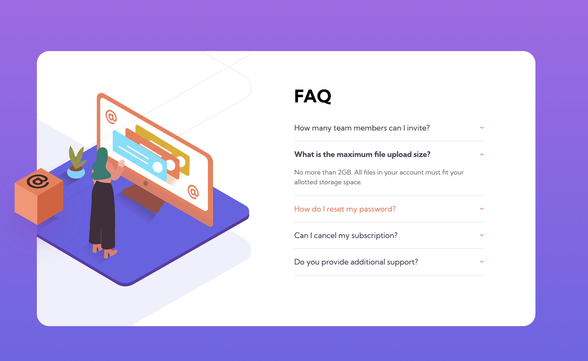

# Frontend Mentor - FAQ accordion card solution

This is a solution to the [FAQ accordion card challenge on Frontend Mentor](https://www.frontendmentor.io/challenges/faq-accordion-card-XlyjD0Oam). Frontend Mentor challenges help you improve your coding skills by building realistic projects.

## Table of contents

- [Overview](#overview)
  - [The challenge](#the-challenge)
  - [Screenshot](#screenshot)
  - [Links](#links)
- [My process](#my-process)
  - [Built with](#built-with)
  - [What I learned](#what-i-learned)
- [Author](#author)

## Overview

### The challenge

Users should be able to:

- View the optimal layout for the component depending on their device's screen size
- See hover states for all interactive elements on the page
- Hide/Show the answer to a question when the question is clicked

### Screenshot

### Links

- [See live site here](https://thomaserdmenger.github.io/faq-accordion-card/)
- [GitHub Repository](https://github.com/thomaserdmenger/faq-accordion-card)

## My process

### Built with

- Semantic HTML5 markup
- CSS custom properties
- Flexbox
- Mobile-first workflow

### What I learned

I learned how to position multiple images with position relative and absolute. I also learned to set specific classes in CSS, which I set to specific DOM elements using the classList() method in JS to achieve the desired effect on the screen.

The most difficult thing for me was to position the images correctly.

## Author

- Frontend Mentor - [@thomaserdmenger](https://www.frontendmentor.io/profile/thomaserdmenger)
- GitHub - [@thomaserdmenger](https://github.com/thomaserdmenger)
